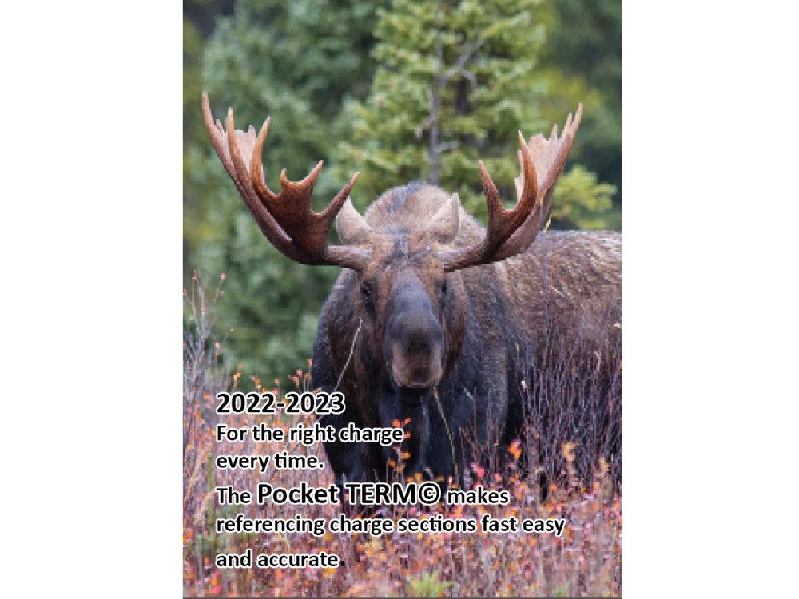
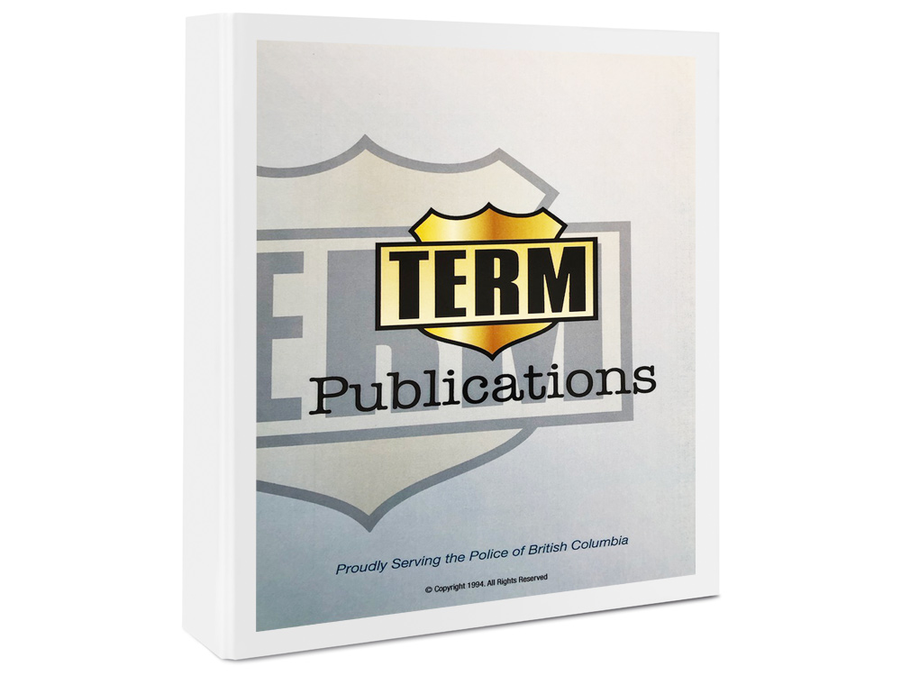
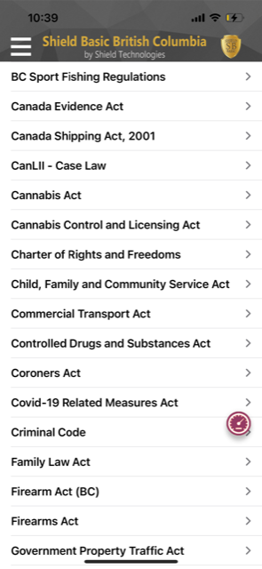
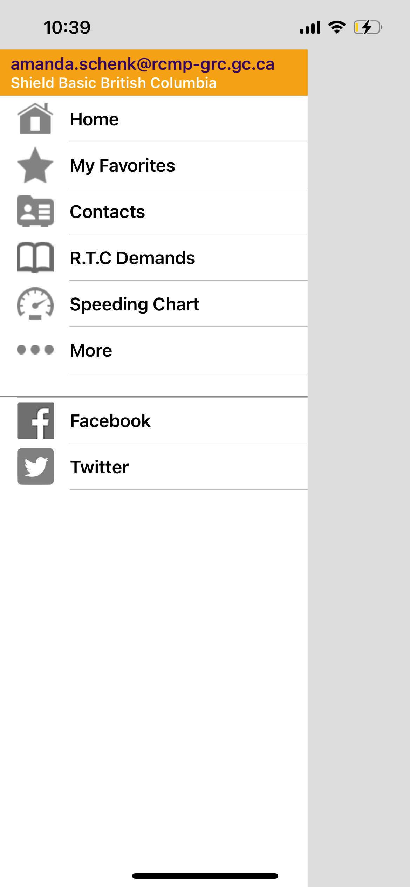
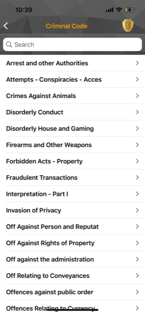
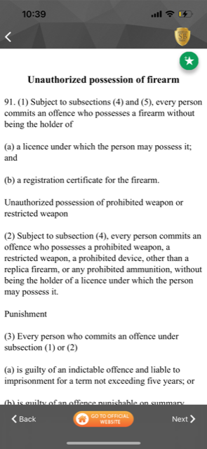
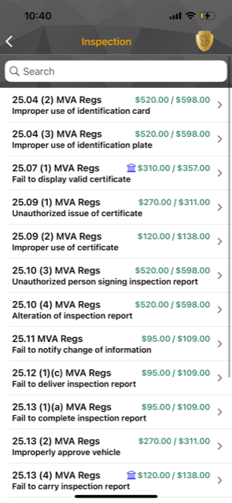
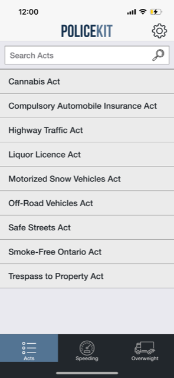
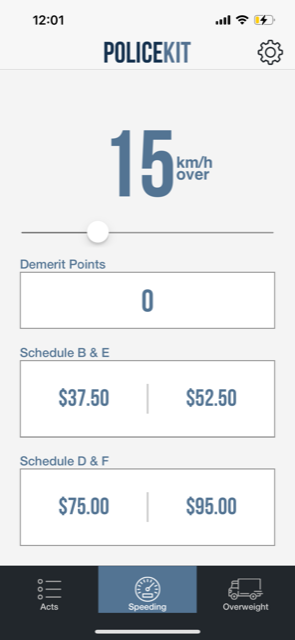
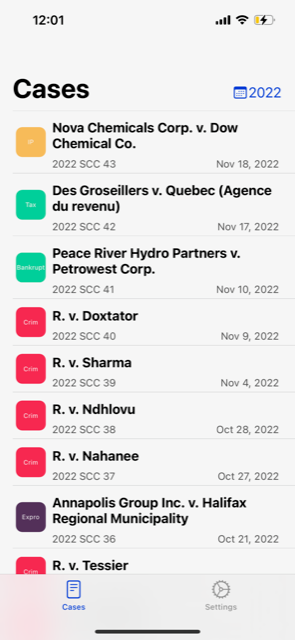

# :trophy: Competitive research
Internal and external products tackling aspects of the same business problem - making relevant and necessary information more accessible to frontline police officers.

## Internal tools

### Traffic Enforcement Reference Manual (T.E.R.M.)
Explain what this is.

**Strengths:** Not sure...

**Weaknesses:** Published on yearly basis - easily outdated.

&nbsp;

### "Cheat Sheets"
Typically seen for highly procedural calls, such as break & enters, impaired driving, mental health calls, and domestic offences.

**Strengths:** Often created by users themselves; easily accessible.

**Weaknesses:** Easily outdated; many versions.

## External applications

### Shield Basic British Columbia
A mobile application developed by an Ontario Provincial Police member. Confirmed use by some members in B.C. law enforcement. 

**Strengths:** Has all content; attempts to include policy. 

**Weaknesses:** Links to external content rather than a true mobile application experience; based on user navigating; user interface design; search.

&nbsp;
&nbsp;
&nbsp;
&nbsp;

### PoliceKit
A mobile application ...

**Strengths:** Turning legislation into tools; user interface design.

**Weaknesses:** Limited content; 

&nbsp;
&nbsp;

### SCC
A mobile application ...

**Strengths:** User interface design; usability (simplicity).

**Weaknesses:** Only scrapes some types of content; only Supreme Court.

&nbsp;

## Others to explore
- Pocket Brainbook (LASD)
- PocketLaw (USA)
